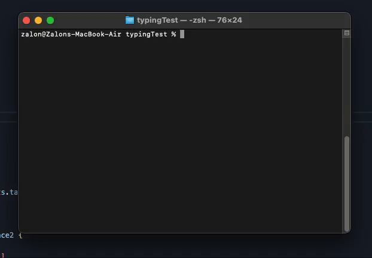

# Typing Test | Go CLI



## Words Per Minute (WPM)
```go
words := float64(stats.correctChars) / 5.0
wpm = words / duration
```
- WPM is calculated assuming an average word length of 5 characters
- Only correctly typed characters are counted
- The formula is: `(correct characters ÷ 5) ÷ minutes elapsed`
- For example, if you correctly typed 250 characters in 1 minute:
  - Words = 250 ÷ 5 = 50 words
  - WPM = 50 words ÷ 1 minute = 50 WPM

## Characters Per Minute (CPM)
```go
cpm = float64(stats.correctChars) / duration
```
- CPM is simply the number of correct characters typed divided by minutes elapsed
- Only correctly typed characters count towards CPM
- For example, if you correctly typed 250 characters in 1 minute:
  - CPM = 250 ÷ 1 = 250 CPM

## Accuracy
```go
if stats.totalChars > 0 {
    accuracy = float64(stats.correctChars) / float64(stats.totalChars) * 100
}
```
- Accuracy is the percentage of correctly typed characters
- Formula: `(correct characters ÷ total characters typed) × 100`
- For example, if you typed 100 characters and 90 were correct:
  - Accuracy = (90 ÷ 100) × 100 = 90%

## Time Calculation
```go
duration := time.Since(stats.startTime).Minutes()
if duration < 0.017 { // Less than 1 second
    return 0, 0, 0
}
```
- Duration is calculated in minutes using Go's time.Since()
- There's a protection against very small durations (< 1 second)
- Live updates happen every 100ms (controlled by statsTicker)

## Character Tracking
- `stats.totalChars`: Counts every character typed, including mistakes
- `stats.correctChars`: Only counts characters that match the target text
- Backspace reduces both counters appropriately
- Spaces count as characters and are tracked the same way

## Visual Feedback
- Yellow: Correctly typed characters
- Red: Incorrectly typed characters
- White (blinking): Current character to type
- Dim white: Upcoming characters
- Cyan: Stats display

This implementation provides a balance between accuracy and real-time feedback, giving users immediate information about their typing performance while maintaining reasonable precision in the calculations.

# Typing Test Metrics Explained

## Word Lists

The English words used in this CLI are sourced from the following repositories:

- [Google 10000 English](https://github.com/first20hours/google-10000-english)
- [Dwyl English Words](https://github.com/dwyl/english-words/tree/master)

The word lists are divided into four files based on word length:

- `short-english.txt`: Contains short English words
- `medium-english.txt`: Contains medium-length English words
- `long-english.txt`: Contains long English words
- `words_list.txt`: Contains a comprehensive list of English words

### Run command
``` sh
go run main.go
```
### Build command
```sh
go build -o typing-test main.go
```